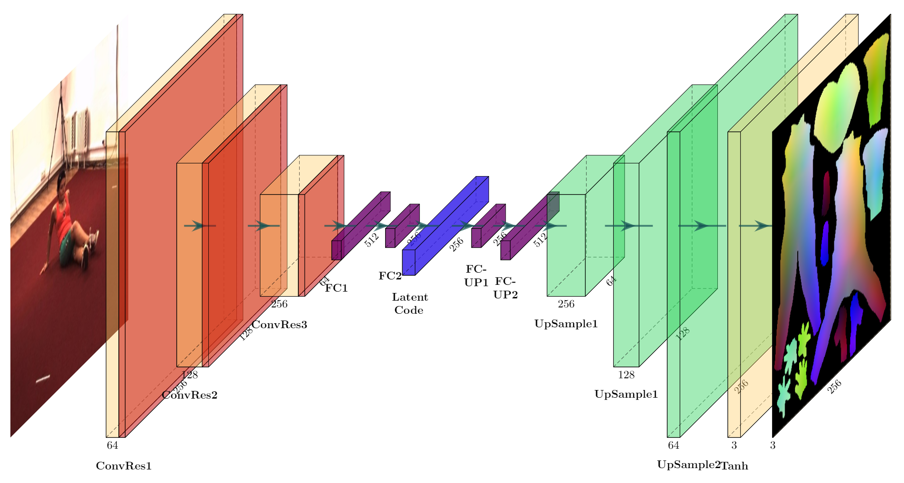

# Use your own networks

Although the paper states that networks choice doesn't really affects the final results, we do observe some differences when training with different networks, with same dataset and same UV mapping. Currently we believe that network architectures could affect the learning dynamics and the speed/accuracy tradeoff. 
Therefore, we detail the architectures of our baseline network here as a reference, and we encourage users to explore different networks. Feel free to open an issue or pull-request of your results.

### The Baseline Network

Current experiments features 6 ConvRes blocks with stride 2 and 2 fc layers for the encoder. The structure of the decoder is symmetric with that of the encoder, with 2 fc layers following by 6 consecutive conv and upsample layers and a final `Tanh()` to get the output UV position map. The overall pipeline is illustrated below (Only 3 conv layers are drawn).



Training after 40 epochs yields following result:
<div align="center>
    
</div>
And here's the resampled body mesh shown in point cloud:

<div align="center>
    
</div>

### Use your own network

Each of the provided models is inherited upon a common `BaseModel` class, and loaded to the training script via `importlib`. All the optimizer scheduling, logging and visualization functionalities are already taken care of, so all you need to do is implement the networks and save it inside `models/networks.py`. We assume an encoder-decoder architecture, so you need to implement an encoder and a matching decoder.

Now assume you have implemented these two networks, the quickest way to wrap it up for training is as follows:

1. Copy the `./models/resnet_model.py` and rename it as `./models/user_custom_model.py`. 

2. Open the copy file, rename the class as `UserCustomModel(BaseModel)`. Note that the class name should not contain underscores.

3. Open `./models/networks.py`, append your implementation of encoder and decoder at the end of the file. Make sure the arguments list matches that in `define_encoder` and `define_decoder` functions. 

4. Assume you name your networks `UserCustomEncoder` and `UserCustomDecoder`. Inside function `define_encoder`, add another option like this (the decoder follows the same routine):

```
def define_encoder(im_size, nz, nef, netE, ndown, norm='batch', nl='lrelu', init_type='xavier', device=None):
    net = None
    norm_layer = get_norm_layer(layer_type=norm)
    nl = 'lrelu'  # use leaky relu for E
    nl_layer = get_non_linearity(layer_type=nl)
    if netE == 'resnet':
        net = ResNetEncoder(im_size, nz, nef, ndown, norm_layer, nl_layer)
    elif netE == 'vggnet':
        net = VGGEncoder(im_size, nz, nef, ndown, norm_layer, nl_layer)
+   elif netE == 'user_custom':
+       net = UserCustomEncoder(im_size, nz, nef, ndown, norm_layer, nl_layer)
    else:
        raise NotImplementedError('Encoder model name [%s] is not recognized' % netE)

    return init_net(net, init_type, device)
```

5. Inside `train.py`, add your model options inside `choices`,

```
    # model options
    parser.add_argument('--model', type=str, default='resnet', choices=['resnet', 'vggnet', 'mobilenet', **'user_custom'**])
    parser.add_argument('--netD', type=str, default='convres', choices=['convres', 'conv-up', **'user_custom'**])
    
```
The value of ``--netE`` must the same as ``--model`` and your class name. The ``--netD`` option, however, don't need to be the same as ``--model``.

6. Adding the following tags inside `train.sh`: ``--model user_custom --netD user_custom``.

Feel free to leave an issue for any questions.
