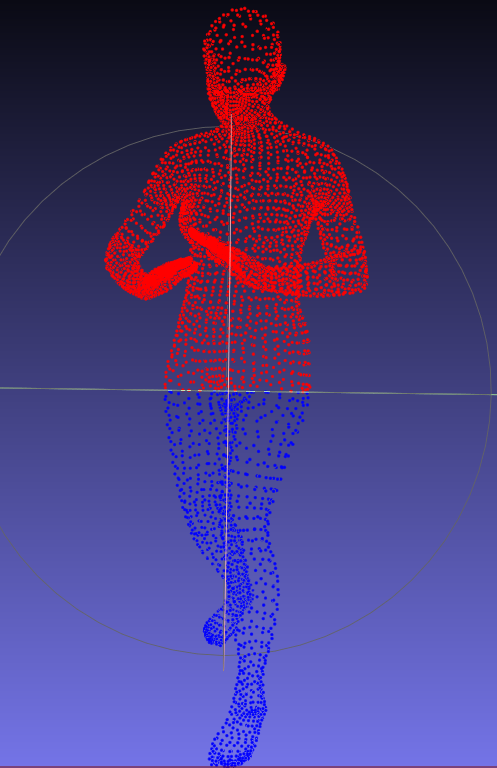
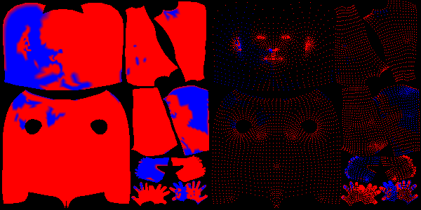

# densebody_pytorch
PyTorch implementation of CloudWalk's recent paper [DenseBody](https://arxiv.org/abs/1903.10153v3)

### Critical Warning
__Anyone help with UV data correction will be deeply appreciated!__

SMPL UV data downloaded from [official website](http://smpl.is.tue.mpg.de) is a total mess up. Here's the result.






### Prerequisites
```
Ubuntu 18.04
CUDA 9.0
Python 3.6
PyTorch 1.0.0
chumpy (For converting SMPL model to basic numpy arrays)
spacepy, h5py (For processing Human36m cdf annotations)
```

(Optional) Install [torch-batched-svd](https://github.com/KinglittleQ/torch-batch-svd) for speedup (Only tested under Ubuntu system).


### TODO List
- [x] Creating ground truth UV position maps for Human36m dataset.
    - [x] [20190329]() Finish UV data processing.
    - [x] [20190331]() Align SMPL mesh with input image.
    - [x] [Testing]() Generate and save UV position map.
        - [ ] [Proceeding]() Checking validity through resampling and mesh reconstruction...
        - [ ] Making UV_map generation module a separate class.
    - [ ] Data washing: Image resize to 256*256 and 2D annotation compensation.
    - [ ] Data Preparation.
- [ ] Finish baseline model training
    - [ ] Testing with several new loss functions.
    - [ ] Testing with different networks.
- [ ] Report 3D reconstruction results.
    - [ ] Setup evaluation protocal and MPJPE-PA metrics.


### Current Progress
Finish UV texture map processing. Here's the result:


Align SMPL meshes with input images. Here are some results:


### Citation
Please consider citing the following paper if you find this project useful.

[DenseBody: Directly Regressing Dense 3D Human Pose and Shape From a Single Color Image](https://arxiv.org/abs/1903.10153v3)

### Disclaimer
Please note that this is an unofficial implementation free for non-commercial usage only. For commercial cooperation please contact the original authors.
